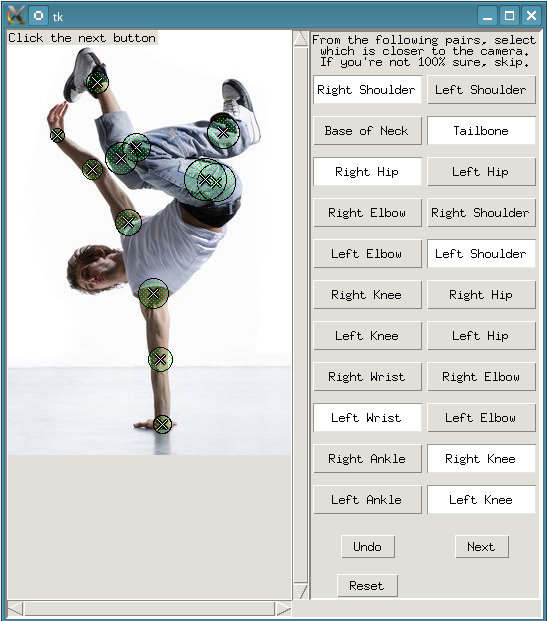
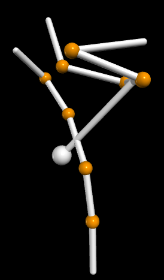
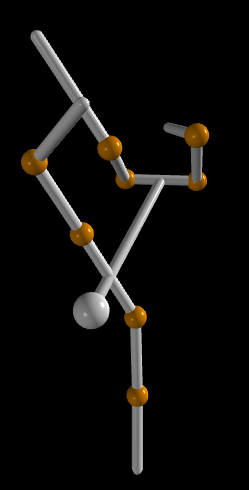

# 3D Human Pose Reconstruction from a 2D Monocular Image with Joint Ordering Uncertainty

Given a picture of a human and the approximate location of joints and their relative z-ordering (closeness to the camera), this script reconstructs an approximation of their 3D pose.

Please refer to the file [3D_Pose_Reconstruction.pdf](3D_Pose_Reconstruction.pdf) for an in-depth explanation of the code, as well as examples of it in action.

## Example




## Setup and Running the Code
Required packages:
* Pillow
* numpy
* scipy
* vpython

To download the code, in a terminal first clone this repository with git:
```
$ git clone https://github.com/cflamant/3d-pose-reconstruction.git
$ cd 3d-pose-reconstruction
$ cd code

To run the script, while in the `code/` directory, execute

```
$ python run.py
```

The program will open a file selection window where you can select which image you want to load, and then you can follow the instructions in the main window. 

After clicking `Next` you will be presented with an image showing which joints have been selected. Closing this window will then open a vpython instance in your browser where you can examine the 3D stick figure that has been generated from the pose information.
