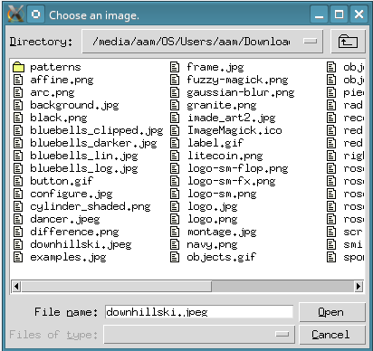
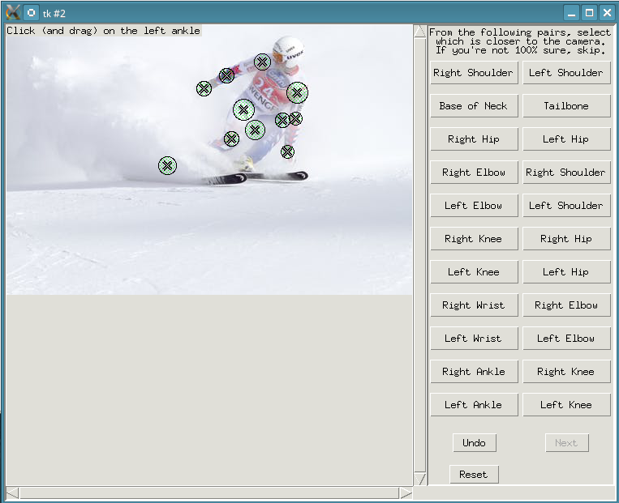
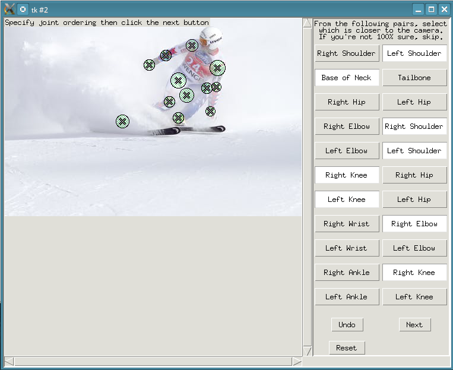
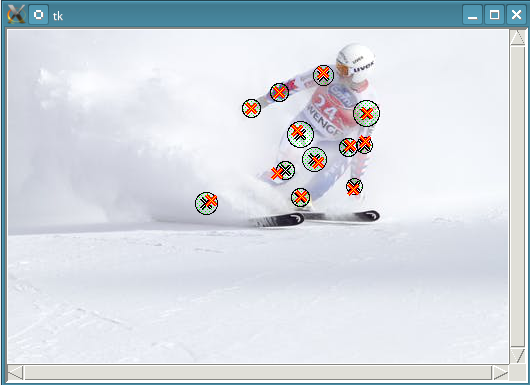
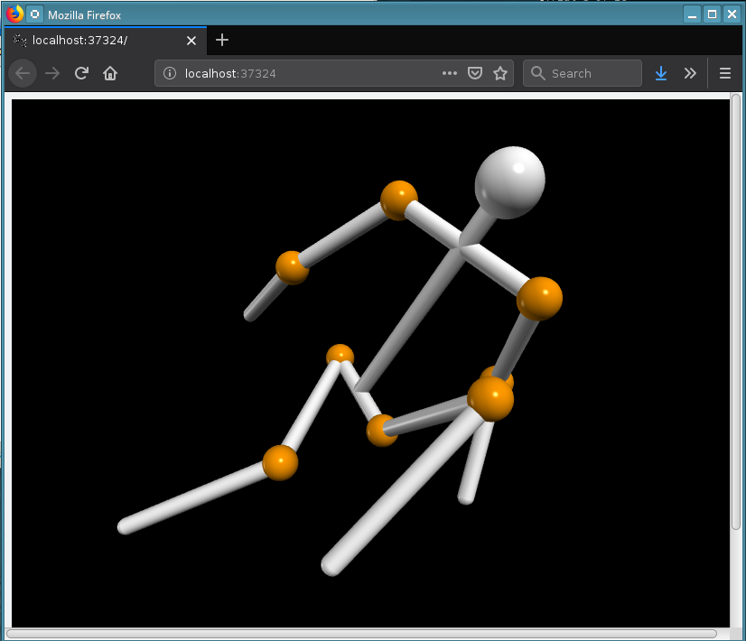
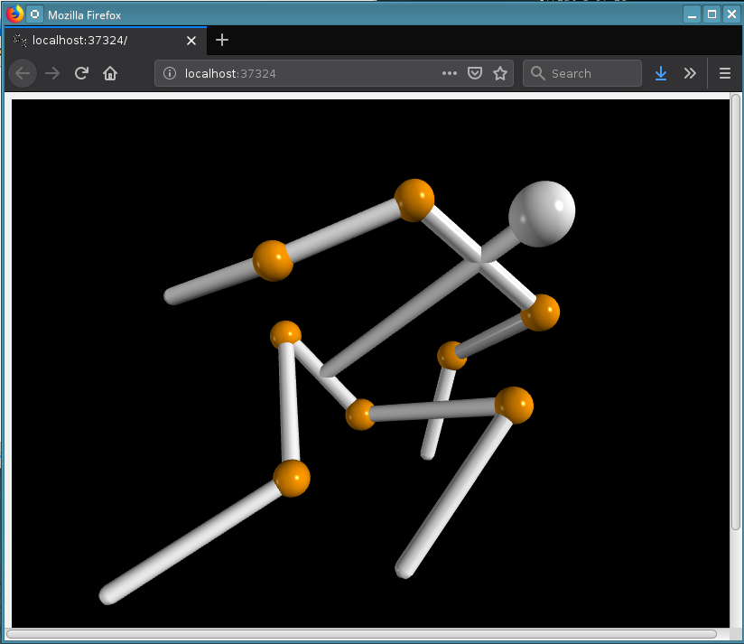

# 3D Human Pose Reconstruction from a 2D Monocular Image with Joint Ordering Uncertainty

Given a picture of a human and the approximate location of joints and their relative z-ordering (closeness to the camera), this script reconstructs an approximation of their 3D pose.

Please refer to the file [3D_Pose_Reconstruction.pdf](3D_Pose_Reconstruction.pdf) for an in-depth explanation of the code, as well as examples of it in action.

## Example


## Setup and Running the Code
Required Python version:
* Python 3.5+

Required packages:
* Pillow
* numpy
* scipy
* vpython

To download the code, in a terminal first clone this repository with git:
```
$ git clone https://github.com/cflamant/3d-pose-reconstruction.git
$ cd 3d-pose-reconstruction
$ cd code
```

To run the script, while in the `code/` directory, execute

```
$ python run.py
```
### Example Run

After running the above command, the program will open a file selection window where you can select which image you want to load:


  Then, in the main window, text in the top left corner will prompt you which joint to select. To select a joint, click and hold at the center of the joint, and drag to set the radius of uncertainty in the joint position. The code will optimize the joint positions within these circles.



  After selecting all the joints, you can input the relative ordering of the two given options. Click the button corresponding to the joint that is closer to the camera. If the relative ordering of a pair of joints is unclear, or if they are close to the same distance from the camera, do not click either button. This specifies to the code to try to keep the two joints in the same z-plane perpendicular to the image plane.



  Optimization of the joints will happen in the terminal, and when it is finished, a window will show you the determined optimized joint positions. You can close this window to proceed.



  A VPython instance will be started in your browser showing a stick figure representation of the reconstructed 3D pose. You can explore the 3D creation by following the instructions in the browser window.





